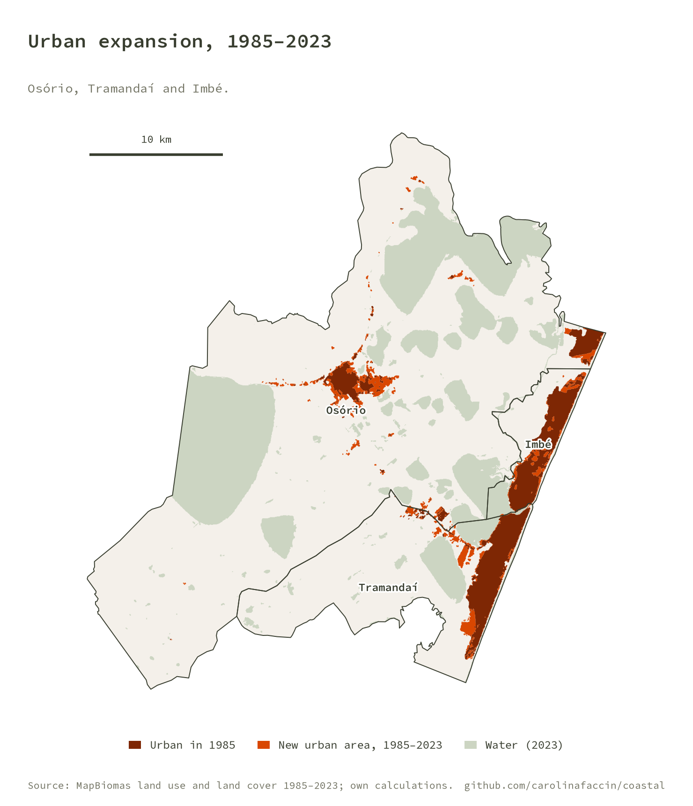
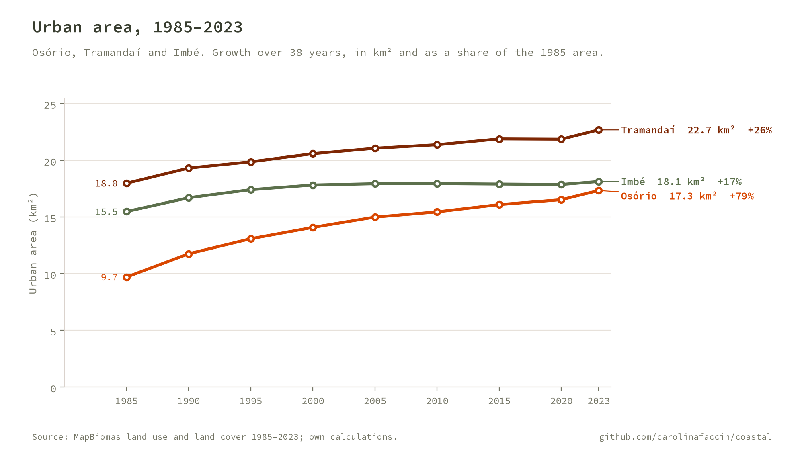
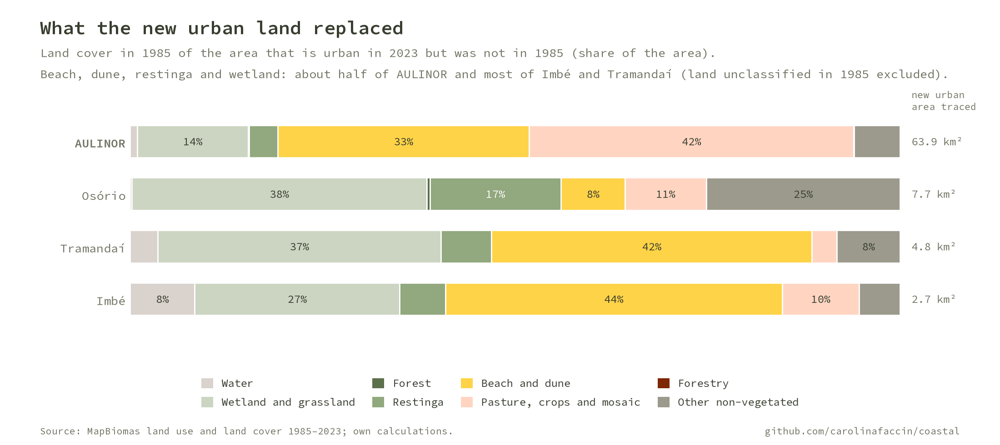
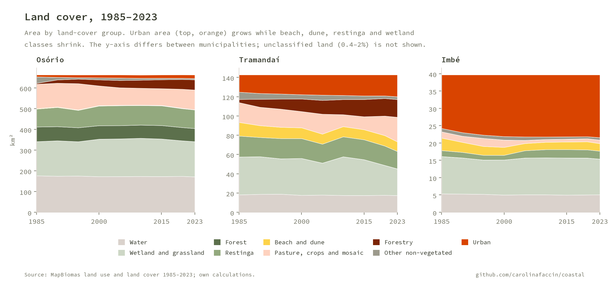
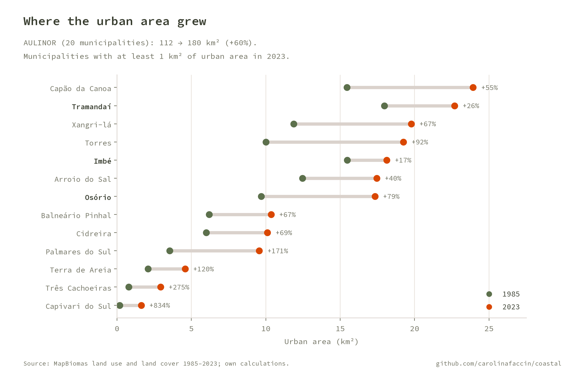
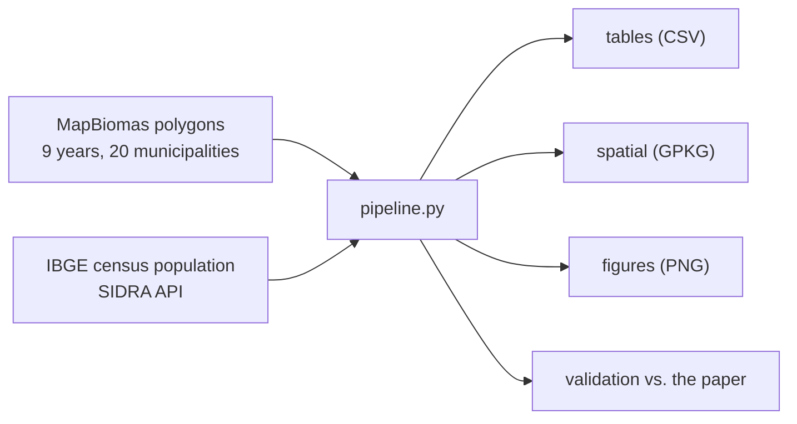

# COASTAL

**Coastal Spatial Transformations: Analysis of Land-use.** A reproducible analysis of urban and land-cover change on the North Coast of Rio Grande do Sul, Brazil, from 1985 to 2023, with a focus on Osório, Tramandaí and Imbé.

It rebuilds, in Python, the calculations behind the paper
[*Padrões de transformação urbana e de uso e cobertura da terra no litoral norte: o caso de Osório, Tramandaí e Imbé*](https://seer.ufrgs.br/index.php/paraonde/article/view/150243)
(Faccin, Souza & Dalcin, 2026) and checks them against the numbers the paper reports.

<p align="center">
  
  
</p>

## Key results

The study area is **AULINOR**, the 20 municipalities of the Litoral Norte urban agglomeration.

- **Urban area grew 60%**, from 112 to 180 km² (+67.6 km²). Osório grew 79%, Tramandaí 26% and Imbé 17%.
- **The new urban land replaced coastal ecosystems.** Of the new urban area that can be traced to a 1985 land-cover class, 51% was beach, dune, restinga or wetland across AULINOR, rising to **85% in Tramandaí** and **76% in Imbé**.
- **Three growth patterns.** Osório has a dispersed, fragmented urban growth; Tramandaí, a major tourist center, shows continuous growth and densification; Imbé has rapid, seasonally driven growth that encroaches on dunes and coastal vegetation.
- **Population followed.** Imbé's population multiplied 3.6 times between the 1991 and 2022 censuses (7,352 to 26,824); Tramandaí's grew 2.7 times.

<p align="center">
  
</p>

<p align="center">
  
</p>

<p align="center">
  
</p>

## How it works



1. **Land cover.** One polygon file per year (1985, 1990, ..., 2023), dissolved by class and municipality. Areas are recomputed from the geometry (SIRGAS 2000 / UTM 22S) and the 15 MapBiomas classes are grouped into 9 groups.
2. **Urban growth.** Urban area per municipality and year, absolute and relative change.
3. **What was replaced.** The 2023 urban polygons are overlaid on the 1985 land cover, leaving out land that was already urban.
4. **Population.** Resident population from the 1991, 2000, 2010 and 2022 censuses, downloaded from IBGE's SIDRA API.
5. **Validation.** The results are compared with the values published in the paper and with the original GIS workbook (see below).

## Run it

```bash
python -m venv venv && source venv/bin/activate
pip install -r requirements.txt
cp config/config.local.json.example config/config.local.json # set raw_dir and data_dir
python pipeline.py                               # tables + spatial + figures + README images
python pipeline.py --only figures docs           # redraw figures only
pytest                                           # unit tests + validation against the paper
```

`config/config.local.json` (gitignored) sets two folders:

| Key | Purpose |
|---|---|
| `raw_dir` | Shared raw-data catalog. Reads the AULINOR polygons from `_projetos/aulinor/` and saves the IBGE download under `ibge/censo/populacao_municipal_sidra/t0/` |
| `data_dir` | This project's outputs: `tables/`, `spatial/`, `figures/` |

## Outputs (`data_dir`)

| File | Content |
|---|---|
| `tables/urban_growth_1985_2023.csv` | Urban area in 1985 and 2023 by municipality, km² and % |
| `tables/urban_area_by_year.csv` | Urban area by municipality and year |
| `tables/landcover_area_by_class.csv` | Area by year, municipality and MapBiomas class |
| `tables/land_replaced_by_urban.csv`, `land_replaced_shares.csv` | 1985 land cover of the new urban area |
| `tables/population_census.csv`, `population_growth.csv` | Census population and growth |
| `tables/qa_coverage.csv` | Classified vs. unclassified area per year |
| `tables/validation.csv` | Computed vs. published values |
| `spatial/aulinor_urban_expansion.gpkg` | Layers `urban_1985`, `urban_2023`, `urban_new` |
| `figures/*.png` | All figures (five of them are copied to `docs/img/` for this README) |

## Validation

`pipeline.py` stops with an error if a computed value drifts from the published one.

| Check | Published | Computed |
|---|---|---|
| AULINOR urban area 1985 (km²) | 112 | 112.0 |
| AULINOR urban area 2023 (km²) | 180 | 179.7 |
| AULINOR urban growth | 60% | 60.4% |
| Imbé urban growth | +2.6 km² (17.1%) | +2.65 km² (17.1%) |
| Tramandaí urban growth | +4.7 km² (26.2%) | +4.71 km² (26.2%) |
| Osório urban growth | 79% | 78.8% |
| Imbé population, 2022 / 1991 | 3.6x | 3.65x |
| Urban area vs. the original GIS workbook, 172 municipality-years | n/a | max difference 0.014 km² |

## Notes on the data

- **Source:** MapBiomas annual land use and land cover, 1985–2023, clipped to the AULINOR municipalities and vectorized in a GIS beforehand. The pipeline starts from those polygons, not from the original rasters.
- **Unclassified land.** The yearly polygon files leave 0.4% to 2% of the municipal area without a class (for example, pixels not observed by the satellite). It is reported in `qa_coverage.csv`, not filled. Because of it, about 6% of the new urban area (3.8 km²) cannot be traced to a 1985 class and is left out of the "what was replaced" shares.
- **Leftover polygons.** Six of the nine yearly files carry polygons without a class or without a municipality, a by-product of the GIS dissolve. They are dropped on load; none can be urban.
- **Regional population.** The 20 AULINOR municipalities grew 27.0% between 2010 and 2022. The paper reports 25.8% for its region, probably a different municipality set, so that value is not part of the validation.

## Repository layout

```
pipeline.py            orchestrator (tables, figures, docs)
src/coastal/
  config.py            paths from config/config.local.json
  classes.py           MapBiomas classes, groups and brand colors
  landcover.py         load the polygons
  metrics.py           urban growth, replaced land, QA, validation
  population.py        IBGE SIDRA download
  figures.py, style.py figures in the project's visual identity
tests/                 synthetic unit tests + validation against the paper
assets/fonts/          Source Code Pro (SIL OFL)
```

## Credits

Paper: Faccin, C. R.; Souza, J. L.; Dalcin, G. K. (2026). *Padrões de transformação urbana e de uso e cobertura da terra no litoral norte: o caso de Osório, Tramandaí e Imbé.* Para Onde!?, UFRGS.

Data: [MapBiomas](https://mapbiomas.org/) and [IBGE](https://www.ibge.gov.br/). Figures use the Source Code Pro typeface (SIL Open Font License).

## License

GNU General Public License v3.0, see [LICENSE](LICENSE).
